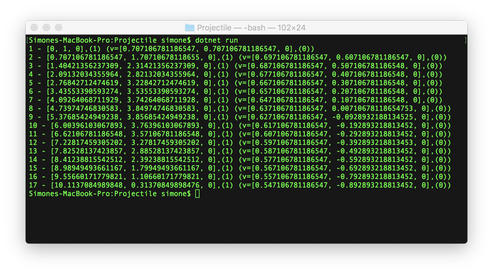

# The Ray Tracer Challenge - Implementing primitives and vector algebra operations

After setting up the project, it's time to start implementing the code for the first chapter of the book, which focuses mostly on defining primitives (Point and Vectors), and vector algebra operations like addition, subtraction and also dot and cross products.

## Challenges encountered

At first, it looked a simple task: how hard could it be to write some methods to perform simple addition, subtractions, and some other basic formulas?

But it was not. 

### "Re-learning" vector algebra

The first main challenge was "re-learning" vector algebra, and the meaning of the various operations. The book explained well enough for the purpose of the implementation, but I wanted to understand a bit more, and Wikipedia helped a lot. Here some of the links I found:

 * [Euclidean vector](https://en.wikipedia.org/wiki/Euclidean_vector)
 * [Dot product](https://en.wikipedia.org/wiki/Dot_product)
 * [Cross product](https://en.wikipedia.org/wiki/Cross_product)

### Modeling the primitives

The main primitive in the 3D space is a Tuple (of 4 elements), with the 3 coordinates (`x`, `y`, `z`) and a value (`w`) to identify it is either a vector (`w=0`) or a point (`w=1`). I don't know if this is a standard approach or just something the author of the book came up with. Additionally, in chapter 1 the reasoning is not explained but refers to a later chapter to better understand the meaning of this abstraction.

In order to simplify the creation points and vectors, as tuples with the correct value for `w`, it suggests creating factory methods.

But the book uses pseudocode so that the ray tracer can be implemented in any language, both procedural and object-oriented. For this reason, no additional advice is given on how to actually implement it. 

I tried a few approaches.

#### Inheritance

Instead of creating factory methods, since C# is an object-oriented language, I implemented the primitives as a `Tuple` base class, that implements all common operations, and two subclasses, `Point` and `Vector`, whose constructor sets the correct value for the `w` parameter. 

```
public class Tuple
{
    public Tuple(double x, double y, double z, double w)
    {
        X = x;
        Y = y;
        Z = z;
        W = w;
    }

    public double X { get; set; }
    public double Y { get; set; }
    public double Z { get; set; }
    public double W { get; set; }

    public Tuple Add(Tuple other)
    {
        return new Tuple(
            X + other.X,
            Y + other.Y,
            Z + other.Z,
            W + other.W
        );
    }

    // All other operations
    ...
}

public class Point : Tuple
{
    public Point(double x, double y, double z) : base(x, y, z, 1.0f) { }
}

public class Vector : Tuple
{
    public Vector(double x, double y, double z) : base(x, y, z, 0) { }
}

```

It all went fine in the implementation of the library, but things started to fail in the first exercise. The reason is that adding a `Point` to a `Vector` should produce a `Point`. But with this inheritance scheme, that addition will create a `Tuple` that cannot be cast to a `Point`. It took me a while to understand that there is no way around this problem (it's actually how inheritance works).

A `Projectile` (the exercise is a simple ballistic trajectory calculator) is defined as:

```
public Projectile(Point position, Vector velocity)
{
    Position = position;
    Velocity = velocity;
}
```

When updating the position of the projectile after one *tick* you have to add the current position to the current velocity. The result is logically another point (the new `w` is `1+0=1`), but the `Add` method returns a new `Tuple`, and this cannot be cast to a `Point` later on.

```
public static Projectile Update(Projectile p, Environment e)
{
    return new Projectile(
        p.Position.Add(p.Velocity),
        p.Velocity.Add(e.Gravity).Add(e.Wind)
    );
}
```

You can see far I went before getting stuck, on my repo, on branch [Chapter 1.2](https://github.com/simonech/ray-tracer-challenge-netcore/tree/Chapter-1.2).

It's a pity this doesn't work because that would have allowed the most code re-use and keeping point and vector as two separate entities.

#### Inner value

I then started looking for another solution, to be able to keep the two separate objects, and I implemented them using the "inner value" approach (not sure it's the right name): both `Point` and `Vector` have an "innerValue" object of type `Tuple` on which all operations are done. 

```
public class Tuple
{
    public Tuple(double x, double y, double z, double w)
    {
        X = x;
        Y = y;
        Z = z;
        W = w;
    }

    public double X { get; set; }
    public double Y { get; set; }
    public double Z { get; set; }
    public double W { get; set; }

    public Tuple Add(Tuple other)
    {
        return new Tuple(
            X + other.X,
            Y + other.Y,
            Z + other.Z,
            W + other.W
        );
    }

    // All other operations
    ...
}

public class Point
{
    private Tuple _innerValue;

    public Tuple InnerValue { get => _innerValue; set => _innerValue = value; }

    public Point(double x, double y, double z)
    {
        InnerValue = new Tuple(x, y, z, 1);
    }

    public Point(Tuple tuple)
    {
        InnerValue = tuple;
    }

    public double X { get => _innerValue.X; set => _innerValue.X = value; }
    public double Y { get => _innerValue.Y; set => _innerValue.Y = value; }
    public double Z { get => _innerValue.Z; set => _innerValue.Z = value; }

    public Point Add(Vector other)
    {
        return new Point(InnerValue.Add(other.InnerValue));
    }
    // All other operations
}

public class Vector
{
    private Tuple _innerValue;

    public Tuple InnerValue { get => _innerValue; set => _innerValue = value; }

    public Vector(double x, double y, double z) 
    {
        InnerValue = new Tuple(x, y, z, 0);
    }

    public Vector(Tuple tuple)
    {
        InnerValue = tuple;
    }

    public double X { get => _innerValue.X; set => _innerValue.X = value; }
    public double Y { get => _innerValue.Y; set => _innerValue.Y = value; }
    public double Z { get => _innerValue.Z; set => _innerValue.Z = value; }

    public Vector Add(Vector other)
    {
        return new Vector(InnerValue.Add(other.InnerValue));
    }

    public Vector Add(Point other)
    {
        return new Vector(InnerValue.Add(other.InnerValue));
    }

    //All other operations

}

```

This approach works, but, unlike the previous approach, I had to reimplement all methods, with the logic of the operation, was delegated to the `Tuple`. The advantage of this approach is that it is possible to limit the operations (for example, you cannot add 2 points, or subtract a point from a vector) and specify the correct return type (the sum of two vectors is a vector, but the sum of a point and a vector is a point).

This approach works, but it doesn't feel right. Too much code duplication.

You can see how this was implemented on the branch [inner-element](https://github.com/simonech/ray-tracer-challenge-netcore/tree/inner-element).

#### Using factory methods

Finally, I tried using to the suggestion of the author, and I deleted the two classes, only keeping the `Tuple`, to which I added the 2 static factory methods to set the `w` parameter for points (`w=1`) and vectors (`w=0`). The disadvantage is that I lose the possibility of limiting some operations to either point or vectors and that I cannot easily understand if a tuple is a point or a vector just by reading the code.

```
public class Tuple
{
    public static Tuple Point(double x, double y, double z)
    {
        return new Tuple(x, y, z, 1);
    }

    public static Tuple Vector(double x, double y, double z)
    {
        return new Tuple(x, y, z, 0);
    }

    public Tuple(double x, double y, double z, double w)
    {
        X = x;
        Y = y;
        Z = z;
        W = w;
    }

    public double X { get; set; }
    public double Y { get; set; }
    public double Z { get; set; }
    public double W { get; set; }

    public bool IsPoint { get => W == 1; }
    public bool IsVector { get => W == 0; }

    public Tuple Add(Tuple other)
    {
        return new Tuple(
            X + other.X,
            Y + other.Y,
            Z + other.Z,
            W + other.W
        );
    }

//All other operations

}
```

This book adopts a TTD approach, so a data structure that works now might need some refactoring to support new features. For this reason, I finally decided to use the approach suggested by the author, of using factory methods. I will possibly come back on this decision later in the book when concepts become more clear.

You can see how this was implemented on the branch [factory-methods](https://github.com/simonech/ray-tracer-challenge-netcore/tree/factory-methods).

### Which data type to use

The book suggests using a "native" floating point data type since these values will be used a lot. I decided to use a `double`, even if probably a `float` would be enough, to avoid lots of casting given that all the `System.Math` methods work with `Double` types. And also I'm lazy and I don't want to add `f` every time I want to specify a value as literal (just `1.7` vs `1.7f`).

### Performances

I already see some performance issues in this code: creating a new object every time an operation is done will create zillions of objects, and memory will increase.

Also using fields instead of properties, or using stuct instead of classes might bring some performance improvement.

## Putting it all together

As already mentioned above, the final exercise was about the "Hello World" exercise of vector and physics: the trajectory of a bullet shot with an initial velocity and subject to gravity and wind.

```
using codeclimber.raytracer;
public class Environment
{
    public Environment(Tuple gravity, Tuple wind)
    {
        Gravity = gravity;
        Wind = wind;
    }

    public Tuple Gravity { get; set; }
    public Tuple Wind { get; set; }
}

public class Projectile
{
    public Projectile(Tuple position, Tuple velocity)
    {
        Position = position;
        Velocity = velocity;
    }

    public Tuple Position { get; set; }
    public Tuple Velocity { get; set; }

    public override string ToString()
    {
        return $"{Position} (v={Velocity})";
    }
}

class Program
{
    static void Main(string[] args)
    {
        var p = new Projectile(Tuple.Point(0, 0, 0), Tuple.Vector(1, 1, 0));
        var e = new Environment(Tuple.Vector(0, -0.1, 0), Tuple.Vector(-0.01, 0, 0).Normalize());
        int i = 0;
        while (p.Position.Y >= 0)
        {
            i++;
            sys.Console.WriteLine($"{i} - {p}");
            p = Update(p, e);
        }
    }

    public static Projectile Update(Projectile p, Environment e)
    {
        return new Projectile(
            p.Position.Add(p.Velocity),
            p.Velocity.Add(e.Gravity).Add(e.Wind)
        );
    }
}

```

The code is that simple that it just prints out the list of coordinates.



To see I got it right, I imported the result in excel and drawn a chart.


On my github repository you can have a look at the [code of the exercise](https://github.com/simonech/ray-tracer-challenge-netcore/tree/Chapter1-End/Exercises/Chapter%201), and the output, both [text](https://github.com/simonech/ray-tracer-challenge-netcore/blob/Chapter1-End/Exercises/Chapter%201/Results/trajectory.txt) and [Excel](https://github.com/simonech/ray-tracer-challenge-netcore/blob/Chapter1-End/Exercises/Chapter%201/Results/Projectile-trajectory.xlsx).

## Conclusions

The basic operations are now implemented. The next chapter in the book is about implementing the code to write images on disk, in [PPM format](https://en.wikipedia.org/wiki/Netpbm_format) (I suppose the easiest format to implement).

What do you think? Do you think there is a more elegant way to deal with `Point` and `Vector` other than using the two static factory methods? Anything else?

I've received already some comments from some fellow developer which is also doing this challenge: he suggested that I could use the new `System.MathF` class introduced in .NET Core 2.1, to use floats instead of the double (but I'd still have to type the `f` in literals). He also suggested I use operator overload instead of the methods `Add`, `Subtract`, and so on.

I'll address these two comments and I'll do a bit of performance optimization before starting with calling these simple operation zillion times.