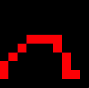

# The Ray Tracer Challenge - Drawing to a canvas and saving the image to a file

In the previous post I've shown how I implemented chapter 1 of the Ray Tracing Challenge book, coding the basic primiteves and their operations. And also implemented a ballistic trajectory calculator. In chapter 2, the goal is to be able to draw an image on a canvas and then saving it to a file.

## Challenges encountered

This was a more straightforward exercise than the one in the previous chapter, but still not everything was simple.

### Modeling the Color class

The concept behind drawing images is very simple. An image is a matrix of pixels, and the value of each pixel is a color. And a color is a "tuple" of three values (the Red, Green, Blue components).

For this reason, the author suggests to refactor the implementation of the `Tuple` so that there is not need to reimplement the basic operations (add, subtract and multiplication by a scalar). I thought of creating a `TupleBase` class, which extends `Array` and implement those 3 operations on the array. Unfortunately, in C#, the `Array` is a sealed class, and cannot be used as base class. I thought of using a `List`, but it would probably with a very high performance cost. I finally decided to just duplicate the code for the 3 operations, and come back to it after this chapter is done. 

```
public class Color
{
    public static readonly Color Black = new Color(0, 0, 0);

    public Color(double r, double g, double b)
    {
        Red = r;
        Green = g;
        Blue = b;
    }

    public double Red { get; set; }
    public double Green { get; set; }
    public double Blue { get; set; }

    //All operations
}
```

On my github repository you see the implementation till this point going the tag [Chapter 2.1](https://github.com/simonech/ray-tracer-challenge-netcore/tree/Chapter-2.1).

### Modeling the Canvas class

The `Canvas` class was pretty straightward to implement. I used an bi-dimensional array to store the values, and implemented an index accessor for setting and reading the values.

```
public class Canvas
{
    private Color[,] canvas;

    public Canvas(int width, int height) : this(width, height, Color.Black)
    {

    }
    public Canvas(int width, int height, Color background)
    {
        Width = width;
        Height = height;
        canvas = new Color[width, height];
        Initialize(background);
    }

    public int Width { get; set; }
    public int Height { get; set; }

    public Color this[int x, int y]
    {
        get
        {
            return canvas[x, y];
        }

        set
        {
            canvas[x, y] = value;
        }
    }
}
```

This indexer works fine, but intellisense doesn't show the name of the variables, and while writing the exercise I wish I wrote an explicit method to set the color of a pixel, like `Canvas.SetPixelAt(int x, int y, Color color)`.

On my github repository you see the implementation of the canvas on the tag [Chapter 2.2](https://github.com/simonech/ray-tracer-challenge-netcore/tree/Chapter-2.2).

Finally, while writing this post I realied I could have used the same approach also for the base tuple class. I guess now I know how to refactor the implementation.

### Implementing the PPM writer

The PPM file format is the most basic file format existing. Each pixel is represented with a string with the three components. If a pixel is white, it will represented as `255 255 255 `, 12 bytes per pixel. While a black pixel will be 6 bytes. This makes it probably the most inefficient image format existing. I guess in my "refactoring sprint", I'll try to implement more efficient format.

Each row of pixel is represented as a series of lines, of max 70 chars, so the code for rendering must also take care of this limit.

```
public string GetPPMContent()
{
    var builder = new StringBuilder();
    builder.AppendLine("P3");
    builder.AppendLine($"{Width} {Height}");
    builder.AppendLine("255");
    for (int y = 0; y < Height; y++)
    {
        int lineLength = 0;
        for (int x = 0; x < Width; x++)
        {
            string[] colorA = canvas[x, y].ToRGBA();
            foreach (var color in colorA)
            {
                if (lineLength + 1 + color.Length > 70)
                {
                    builder.AppendLine();
                    lineLength = 0;
                }
                if(lineLength!=0)
                {
                    builder.Append(" ");
                    lineLength++;
                }
                builder.Append(color);
                lineLength += color.Length;
            }
        }
        builder.AppendLine();
    }
    return builder.ToString();
}
```

This algorithm works, but doesn't feel right. Probably there is a more elegant way of doing it. More food for my refactoring sprint.

## Putting it all together

With those basic image drawing methods implemented, the exercise for chapter 2 was drawing the trajectory implemented in the previous chapter. This was a pretty simple exercise. Only needed to make sure the trajectory felt inside the canvas.

Here is the code for the method that plots the postion of the projectile on the canvas, in red.

```
private static void Draw(Canvas canvas, Tuple position)
{
    var x = (int)sys.Math.Round(position.X);
    var y = canvas.Height - (int)sys.Math.Round(position.Y) - 1;
    //sys.Console.WriteLine($" {x},{y} - {position}");
    if (x >= 0 && x <= canvas.Width - 1 && y >= 0 && y <= canvas.Height - 1)
    {
        canvas[x, y] = new Color(1, 0, 0);
    }
}
```

The complex part of the exercies was finding some initial values that would produce something visible. The values used in chapter 1 would have fit in a 10 by 10 image. 

```
var p = new Projectile(Tuple.Point(0, 0, 0), Tuple.Vector(1, 1, 0).Normalize());
var e = new Environment(Tuple.Vector(0, -0.1, 0), Tuple.Vector(-0.01, 0, 0));
var c = new Canvas(10, 10);
```



To generate something more visible I had to increase the velocity of the projectile by 11 (while keeping gravity and wind the same) and launched it at a steeper angle. And with these values, the chart fit into an image which is 900 per 550.

```
var p = new Projectile(Tuple.Point(0, 1, 0), Tuple.Vector(1, 1.8, 0).Normalize().Multiply(11.3));
var e = new Environment(Tuple.Vector(0, -0.1, 0), Tuple.Vector(-0.01, 0, 0));
var c = new Canvas(900, 550);
```


The trajectory is not very visible

On my github repository you can have a look at the [code of the exercise](https://github.com/simonech/ray-tracer-challenge-netcore/tree/Chapter2-End/Exercises/Chapter%202), and the output, both images, the [10x10](https://github.com/simonech/ray-tracer-challenge-netcore/blob/Chapter2-End/Exercises/Chapter%202/Results/file-10x10.ppm) and [900x550](https://github.com/simonech/ray-tracer-challenge-netcore/blob/Chapter2-End/Exercises/Chapter%202/Results/file-900x500.ppm) sizes.

## Conclusions

This chapter was easier to implement than thhe previous one, but there is still something I'd love to improve. Specifically I'd like to refactor the `Color` implementation as child class of a `TupleBase` shared with the other `Tuple` class for point and vectors. Also see if I can make the PPM serilzation code a bit nicer and find a more storage efficient file format.

Together with these tasks, I also want to go back to the basic primitives and implement math as operations overloads, and do some performance testing to find the most performing data storage solution.

If you like this series of posts and don't want to miss my next episode, please consider subscribing.